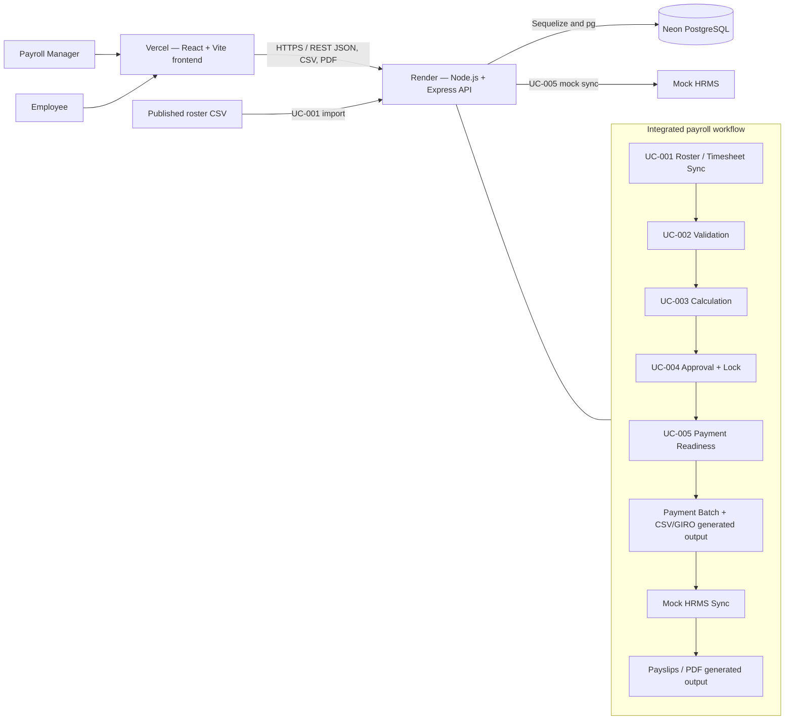

# Payroll Automation System Architecture

## 1. Architecture Overview

Payroll Automation uses a three-tier web architecture. A React/Vite single-page application calls an Express REST API under `/api`; controllers and services apply the cross-UC payroll workflow and persist data through Sequelize or scoped SQL queries in PostgreSQL. A published roster CSV is the UC-001 input. HRMS is an explicit mock integration because no real HRMS API is available.



The required PNG rendering is available at [architecture-diagram.png](architecture-diagram.png).

## 2. Technology Stack

| Area | Current technology | Role |
| --- | --- | --- |
| Frontend | React 19, Vite 8, React Router 7, Material UI 9, Axios | Authenticated user interface, routing and API consumption |
| Backend | Node.js, Express 4 | REST routing and payroll orchestration |
| Data access | Sequelize 6 and `pg` | Models/associations plus existing SQL-oriented services and utilities |
| Database | PostgreSQL 16 | Transactional payroll, audit and snapshot storage |
| Security | JWT, bcrypt, Helmet, CORS, express-rate-limit | Authentication and HTTP/API protection |
| Files | `csv-stringify`, PDFKit | Payroll CSV/GIRO and payslip PDF output |
| Testing | Jest, Supertest | Unit/integration/API verification against PostgreSQL |
| Local infrastructure | Docker Compose | Local PostgreSQL service |

## 3. High-Level System Flow

1. **UC-001 — Roster and timesheet synchronization:** imports a published roster CSV, matches staff, records timesheets/sync data and handles roster exceptions.
2. **UC-002 — Validation:** reviews timesheets and exception outcomes, then freezes accepted payroll input.
3. **UC-003 — Payroll calculation:** creates an immutable numbered `calculation_runs` record and canonical plural `payroll_lines`, applying rates, adjustments and performance inputs.
4. **UC-004 — Approval and locking:** reviews the calculated result, records an approval tied to the selected calculation run and locks the approved pay period.
5. **UC-005 — Payment processing:** validates the approved/locked handoff and bank data, prevents duplicate active Payment Batches, snapshots payment items, produces CSV/GIRO output, performs mock HRMS synchronization and generates payslips after completion.
6. A successful HRMS result completes the Payment Batch and moves the pay period to `paid`; failed synchronization retains the batch for manager retry or eligible cancellation.

## 4. Frontend Architecture

`frontend/src/main.jsx` mounts the React application with `BrowserRouter`, the Material UI theme and shared CSS. `App.jsx` defines public login, authenticated layout and role-aware routes:

- `AuthContext` restores the authenticated user and manages login/logout state.
- `ProtectedRoute` requires authentication; `RoleRoute` restricts manager operations.
- `AppLayout` provides the shared navigation and page outlet.
- Manager pages cover dashboard, roster/staff/pay periods, timesheet validation, calculation, approval, Payment Preview/employee review and Payment Batches.
- Payslip list/detail routes are shared, while backend ownership rules limit employee data to the linked staff record.
- API modules use Axios through `frontend/src/api/client.js`; the API origin is configured by `VITE_BACKEND_URL` or the supported `VITE_API_URL` fallback.

## 5. Backend Architecture

The backend follows the effective request path:

```text
Express route
  -> authentication / authorization / validation middleware
  -> controller
  -> service
  -> Sequelize model or scoped SQL query
  -> PostgreSQL
```

`backend/src/app.js` applies Helmet, CORS, JSON/form parsing, request logging, response helpers and the global error handler before mounting routes at `/api`. Route modules cover roster, timesheets, calculation, approvals, payments, staff, pay periods, authentication, audit logs and payslips. Yup validators protect current UC-005 contracts; other integrated UCs retain their existing controller validation patterns.

Success response shapes are endpoint-specific because integrated controllers come from multiple UCs. Errors handled by the current global handler use `{ success: false, error: { code, message, details } }`. Authentication resolves the bearer JWT to an active `user_account`; authorization then enforces manager or employee access. Services contain transactional business rules, snapshot generation, file output and audit recording.

## 6. Database Architecture

The 22 retained SQL migrations form an incremental compatibility history. Current logical entity groups are:

| Group | Important canonical entities |
| --- | --- |
| Identity/shared | `user_account`, `staff`, `pay_period`, `audit_log` |
| UC-001/UC-002 | `timesheet`, `timesheet_exception` and validation/resolution fields |
| UC-003 | `pay_rate`, `statutory_rate_sets`, `cpf_rate_bands`, `performance_inputs`, `payroll_adjustments`, `calculation_runs`, `payroll_lines`, `uc003_audit_log`, `payroll_edit_log` |
| UC-004 | `approval`, including `approval.calculation_run_id` |
| UC-005 | `payment_batch`, `payment_batch_item`, `payslip` |

Key relationships carry one pay period through calculation, approval and payment. A calculation run owns many payroll lines; an approval identifies the approved calculation run; a Payment Batch references that run/pay period and owns many immutable snapshot items and payslips. Staff links payroll output, bank readiness and employee payslip ownership. Authenticated actors link generation, cancellation and audit events.

Historical `users` and singular `payroll_line` structures may remain in migration compatibility paths. They are not the canonical current UC-005 design: current authentication uses `user_account`, and the approved payroll handoff uses `calculation_runs` plus plural `payroll_lines`.

## 7. Authentication and Security

- Login verifies bcrypt password hashes and returns a signed JWT; disabled accounts are rejected.
- Bearer-token middleware reloads the active user and rejects missing, invalid or expired tokens.
- Manager-only frontend routes are backed by server-side role authorization for payment, bank-update, all-payslip and audit operations.
- Employee payslip detail/PDF access is checked against `user_account.staff_id`.
- Helmet sets HTTP security headers; CORS permits the configured `FRONTEND_URL`.
- Login is rate-limited to ten attempts per 15-minute window.
- Full bank account data is not returned by Payment Batch/payslip views; masking is applied, and bank-update audit details omit the submitted value.
- Payment, HRMS, bank, payslip and authentication activity is recorded in audit structures.

The project does not claim encryption at rest; production database security is the responsibility of the selected managed provider and deployment configuration.

## 8. Testing Architecture

`backend/tests/` is the authoritative Jest root. Supertest exercises the Express API, while unit and integration suites cover calculation and infrastructure behavior. Member folders under root `tests/` are individual evidence and are excluded from Jest discovery.

`backend/scripts/run-tests.js` obtains an administrative PostgreSQL connection, creates a uniquely named `payroll_jest_test_*` database, applies all migrations and all eight automatically executed SQL seed files, runs Jest serially and drops the database in `finally`. The original integrated seed set contained six files; `011_uc001_roster_expanded.sql` and `060_uc004_demo_pending.sql` were integrated later and are now included automatically by `npm run seed`. Guards reject an empty name, a non-owned name or the protected `payroll_automation` database.

Current verified result: **20 suites, 183 tests, 0 failures, 0 skipped/todo**. The committed coverage collection is broader and UC-003-oriented, so its global threshold can fail even when every test passes; this is separate from functional suite status and individual evidence.

## 9. Local Development Architecture

```text
Browser http://localhost:5173
    -> Vite React application
    -> http://localhost:5000/api
    -> Express backend
    -> PostgreSQL Docker container on localhost:5432
```

The backend also exposes `/health` and `/api/health`. The roster adapter reads `ROSTER_SHEET_CSV_URL` when a sync is requested. Local HRMS behavior is selected with `HRMS_MODE=mock`.

## 10. Deployment Architecture

The production system is deployed from the `main` branch using this architecture:

```text
Payroll Manager / Employee
    -> Vercel — React/Vite frontend
    -> HTTPS REST API
    -> Render — Node.js/Express backend
         |-> Neon PostgreSQL
         |<- published roster CSV (UC-001 input)
         |-> CSV/GIRO payment files (generated on demand)
         |-> Mock HRMS (UC-005 integration)
         `-> payslip PDFs (generated on demand)
```

The frontend is deployed on Vercel at [https://payroll-automation-three.vercel.app](https://payroll-automation-three.vercel.app/) and the backend is deployed on Render at [https://payroll-automation-zekw.onrender.com](https://payroll-automation-zekw.onrender.com/). PostgreSQL is hosted on Neon. The Render [`/health`](https://payroll-automation-zekw.onrender.com/health) endpoint verifies backend and database connectivity and has returned `{"status":"ok","database":"connected"}` in production.

Render uses its environment-provided port. Local development continues to use Vite on `5173`, Express on `5000`, and PostgreSQL on `5432`; production users access the provider HTTPS URLs rather than those local ports.

CSV/GIRO payment files and payslip PDFs are generated on demand. The implemented design does not require Cloudinary, Google Drive, or another external persistent file-storage service, and the generated outputs are not represented as cloud-stored assets.

## 11. Key Design Decisions

- Migration history 001–015 and later integration migrations were retained instead of rebaselined, protecting teammate migration histories and compatibility.
- `calculation_runs` and plural `payroll_lines` are the canonical calculated-payroll handoff.
- UC-005 accepts only a calculation-linked approval for an approved and locked pay period.
- `payment_batch_item` and `payslip` preserve historical payment/payroll values rather than rereading mutable staff master data for past output.
- The term **Payment Batches** is preserved across UI, API and documentation.
- HRMS remains a deterministic mock with failure/retry behavior because no external HRMS API is available.
- Test runs use disposable databases so destructive integration tests never target the normal development database.
