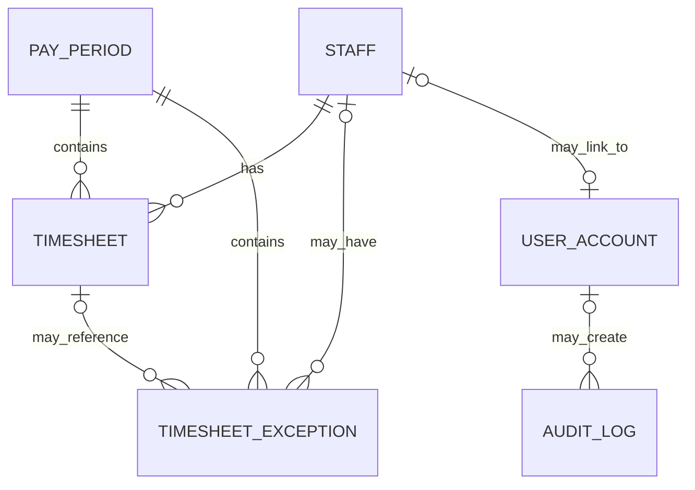

# UC002 – Database Schema

## Scope

UC002 uses the shared PostgreSQL database rather than creating a separate validation database. The feature reads from `staff`, `pay_period`, and `timesheet`, stores discrepancies in `timesheet_exception`, and writes user actions to `audit_log`. Authentication is provided through the shared `user_account` table.

Migration `006_uc002_validation_support.sql` extends the existing `timesheet_exception` table. It intentionally does **not** create a separate `validation_flag` table, which avoids duplicate representations of the same validation finding.

## Entity Relationship Diagram

`audit_log.entity_id` is used as a logical reference to the audited entity, such as a `pay_period`, but it is not enforced as a database foreign key.

---

## 1. `staff`

Shared employee master data used to identify active staff and group timesheet validation results.

| Field | Type | Constraints / Meaning |
|---|---|---|
| `id` | UUID | Primary key, defaults to generated UUID. |
| `external_ref` | VARCHAR | Unique external staff reference. |
| `full_name` | VARCHAR | NOT NULL. |
| `employment_type` | VARCHAR | NOT NULL; `part_time` or `full_time`. |
| `bank_account_no` | VARCHAR | Nullable shared payroll field. |
| `bank_code` | VARCHAR | Nullable shared payroll field. |
| `cpf_eligible` | BOOLEAN | Defaults to `true`. |
| `status` | VARCHAR | Defaults to `active`; `active` or `inactive`. |
| `created_at` | TIMESTAMP | Defaults to `now()`. |
| `updated_at` | TIMESTAMP | Defaults to `now()`. |

**UC002 use:** Validation checks all active staff and creates a missing-entry exception when an active staff member has no matched timesheet row in the selected period.

---

## 2. `pay_period`

Defines the payroll period being reviewed and records whether timesheet validation has been completed.

| Field | Type | Constraints / Meaning |
|---|---|---|
| `id` | UUID | Primary key, generated UUID. |
| `start_date` | DATE | NOT NULL and unique. |
| `end_date` | DATE | NOT NULL. |
| `status` | VARCHAR | Defaults to `draft`; UC002 sets this to `validated` when completed. |
| `validated_at` | TIMESTAMP | Nullable; set by UC002 when validation is completed. |
| `total_gross` | NUMERIC(12,2) | Shared payroll field. |
| `total_net` | NUMERIC(12,2) | Shared payroll field. |
| `created_at` | TIMESTAMP | Defaults to `now()`. |
| `updated_at` | TIMESTAMP | Defaults to `now()`. |
| `is_locked` | BOOLEAN | Shared field added by payment functionality; defaults to `false`. |
| `locked_at` | TIMESTAMP | Nullable shared payment field. |

**Relationships:**

- One `pay_period` has many `timesheet` rows through `timesheet.pay_period_id`.
- One `pay_period` has many `timesheet_exception` rows through `timesheet_exception.pay_period_id`.

---

## 3. `timesheet`

Stores roster-derived shift records. UC002 validates these rows and freezes them after successful finalisation.

| Field | Type | Constraints / Meaning |
|---|---|---|
| `id` | UUID | Primary key, generated UUID. |
| `pay_period_id` | UUID | NOT NULL; foreign key to `pay_period(id)`. |
| `staff_id` | UUID | Nullable; foreign key to `staff(id)`. Unmatched roster rows may not have a staff ID. |
| `roster_raw_name` | VARCHAR | Original roster name for unmatched/invalid rows. |
| `total_hours` | NUMERIC(6,2) | Defaults to `0`; used by daily/weekly validation. |
| `ot_hours` | NUMERIC(6,2) | Defaults to `0`. |
| `ph_hours` | NUMERIC(6,2) | Defaults to `0`. |
| `is_frozen` | BOOLEAN | Defaults to `false`; UC002 sets it to `true` when the period is validated. |
| `match_status` | VARCHAR | `matched`, `unmatched`, or `invalid_time`. |
| `created_at` | TIMESTAMP | Defaults to `now()`. |
| `updated_at` | TIMESTAMP | Defaults to `now()`. |
| `shift_date` | DATE | Date of the shift. |
| `clock_in` | VARCHAR | Shift start time from roster data. |
| `clock_out` | VARCHAR | Shift end time from roster data. |
| `match_method` | VARCHAR | Match source such as `id` or `name`; nullable for unmatched/invalid rows. |

**UC002 use:**

- Reads `total_hours` for daily and weekly thresholds.
- Reads `shift_date`, `clock_in`, and `clock_out` for overlap detection.
- Reads `match_status` to identify unmatched/invalid rows.
- Updates `total_hours` when a manager selects the `corrected` resolution.
- Sets `is_frozen = true` when the pay period is successfully validated.

---

## 4. `timesheet_exception`

Stores UC002 validation findings and manager decisions.

| Field | Type | Constraints / Meaning |
|---|---|---|
| `id` | UUID | Primary key, generated UUID. |
| `timesheet_id` | UUID | Nullable foreign key to `timesheet(id)`. It is nullable because weekly-cap and missing-entry findings may not refer to one row. |
| `rule_type` | VARCHAR | NOT NULL; `overlap`, `exceeds_cap`, `missing_entry`, or `public_holiday`. |
| `status` | VARCHAR | Defaults to `open`; `open`, `corrected`, `noted`, or `returned`. |
| `note` | TEXT | Validation explanation or manager note. |
| `resolved_by` | VARCHAR | Email/identifier of the manager who resolved the exception. |
| `created_at` | TIMESTAMP | Defaults to `now()`. |
| `updated_at` | TIMESTAMP | Defaults to `now()`. |
| `pay_period_id` | UUID | Foreign key to `pay_period(id)` with `ON DELETE CASCADE`. |
| `staff_id` | UUID | Nullable foreign key to `staff(id)`. |
| `expected_value` | NUMERIC(8,2) | Optional expected threshold/value. |
| `actual_value` | NUMERIC(8,2) | Optional actual detected value. |

### Indexes Added by UC002

| Index | Columns | Purpose |
|---|---|---|
| `idx_timesheet_exception_period_status` | `pay_period_id, status` | Speeds up unresolved-exception checks by period. |
| `idx_timesheet_exception_staff` | `staff_id` | Speeds up staff-related exception queries. |

### Migration Behaviour

Migration `006_uc002_validation_support.sql`:

1. removes the NOT NULL requirement from `timesheet_id`;
2. adds `pay_period_id`, `staff_id`, `expected_value`, and `actual_value`;
3. backfills `pay_period_id` and `staff_id` for existing exception rows through their related timesheet;
4. creates the two UC002 indexes above.

---

## 5. `audit_log`

Shared audit table used by UC002 to record validation actions.

| Field | Type | Constraints / Meaning |
|---|---|---|
| `id` | UUID | Primary key, generated UUID. |
| `entity_type` | VARCHAR | NOT NULL; UC002 uses `pay_period`. |
| `entity_id` | UUID | Nullable logical entity identifier; UC002 stores the pay-period UUID. |
| `action` | VARCHAR | NOT NULL; action code. |
| `actor` | VARCHAR | NOT NULL; usually the manager email. |
| `detail` | JSONB | Legacy shared detail field. |
| `created_at` | TIMESTAMP | Defaults to `now()`. |
| `user_id` | UUID | Nullable foreign key to `user_account(id)`. |
| `user_role` | VARCHAR(30) | Role captured for the action. |
| `ip_address` | VARCHAR(64) | Request IP address where available. |
| `details` | JSONB | Extended structured details used by the shared audit service. |

### UC002 Audit Actions

- `TIMESHEET_VALIDATION_RUN`
- `TIMESHEET_EXCEPTION_RESOLVED`
- `TIMESHEET_EXCEPTIONS_BULK_RESOLVED`
- `TIMESHEET_PERIOD_VALIDATED`

---

## 6. `user_account`

Shared authentication table used to authenticate the manager before UC002 routes can be accessed.

| Field | Type | Constraints / Meaning |
|---|---|---|
| `id` | UUID | Primary key, generated UUID. |
| `full_name` | VARCHAR(150) | NOT NULL. |
| `email` | VARCHAR(255) | UNIQUE and NOT NULL. |
| `password_hash` | VARCHAR(255) | NOT NULL. |
| `role` | VARCHAR(20) | NOT NULL; `manager` or `employee`. |
| `staff_id` | UUID | UNIQUE, nullable foreign key to `staff(id)`. |
| `status` | VARCHAR(20) | NOT NULL; defaults to `active`; `active` or `disabled`. |
| `last_login_at` | TIMESTAMP | Nullable. |
| `created_at` | TIMESTAMP | Defaults to current timestamp. |
| `updated_at` | TIMESTAMP | Defaults to current timestamp. |

**UC002 security relationship:** The timesheet routes require a valid authenticated user and specifically authorise the `manager` role. The user identity is also passed to the audit service for traceability.

---

## Relationship Summary

| Parent | Child | Relationship |
|---|---|---|
| `staff.id` | `timesheet.staff_id` | One staff member may have many timesheet rows. |
| `pay_period.id` | `timesheet.pay_period_id` | One pay period contains many timesheet rows. |
| `timesheet.id` | `timesheet_exception.timesheet_id` | An exception may reference one timesheet; the FK is nullable. |
| `pay_period.id` | `timesheet_exception.pay_period_id` | One pay period may contain many validation exceptions. |
| `staff.id` | `timesheet_exception.staff_id` | One staff member may have many validation exceptions. |
| `staff.id` | `user_account.staff_id` | A user account may optionally map to one staff record. |
| `user_account.id` | `audit_log.user_id` | One user may create many audit events. |
