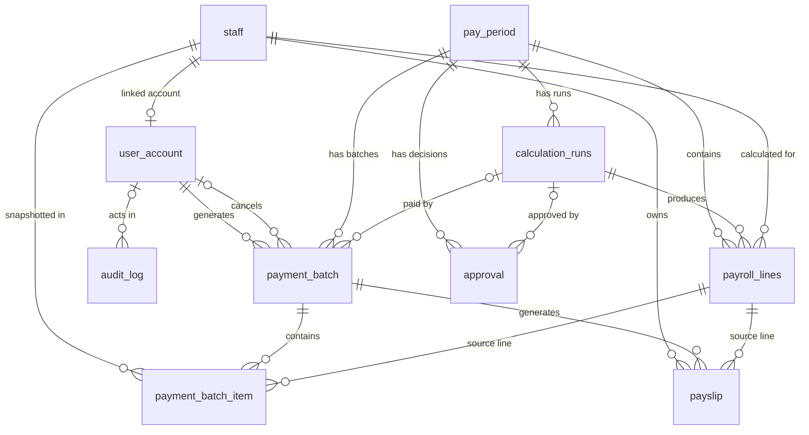

# UC-005 — Database Schema

## 1. Schema Overview

UC-005 consumes payroll output; it does not recalculate payroll. Payment readiness selects an approved `approval`, follows `approval.calculation_run_id` to the canonical `calculation_runs` record, and reads that run's complete `payroll_lines` for an approved and locked `pay_period`.

Generation creates a `payment_batch` linked to the period, calculation run, and authenticated manager. It copies employee, bank, and monetary values into `payment_batch_item` snapshot rows. These rows preserve what was submitted for payment even if upstream payroll or staff master data later changes. Successful mock HRMS synchronization completes the Payment Batch, marks the period paid, and creates `payslip` snapshots for later authorized access and PDF generation. `audit_log` records important authentication, payment, HRMS, payslip, bank-update, view, and download actions.

The primary UC-005 runtime tables are `payment_batch`, `payment_batch_item`, `payslip`, and the UC-005 extensions to `audit_log`. The other tables below are documented only as required upstream or security dependencies and are not claimed as UC-005-owned implementations.

## 2. Entity Relationship Overview



`audit_log.entity_id` is a polymorphic identifier, not a foreign key to each possible audited entity, so those logical audit links are not drawn as database relationships. The optional side on `calculation_runs` reflects that `approval.calculation_run_id` and `payment_batch.calculation_run_id` are nullable in the database, although UC-005 requires them during generation.

## 3. Table Definitions

### `user_account`

Authenticated application identities. UC-005 introduced this table, but it is now a shared identity dependency.

| Column | Type | Key / Constraint | Purpose |
| --- | --- | --- | --- |
| `id` | `UUID` | PK; default `uuid_generate_v4()` | Authenticated actor ID |
| `full_name` | `VARCHAR(150)` | NOT NULL | Display/audit actor name |
| `email` | `VARCHAR(255)` | UNIQUE, NOT NULL | Login identifier |
| `password_hash` | `VARCHAR(255)` | NOT NULL | BCrypt password hash |
| `role` | `VARCHAR(20)` | NOT NULL; CHECK `manager`, `employee` | API authorization role |
| `staff_id` | `UUID` | UNIQUE; nullable FK → `staff.id` | Links an employee account to its staff identity |
| `status` | `VARCHAR(20)` | NOT NULL; default `active`; CHECK `active`, `disabled` | Login/token eligibility |
| `last_login_at` | `TIMESTAMP` | Nullable | Most recent successful login |
| `created_at`, `updated_at` | `TIMESTAMP` | Default current timestamp | Record timestamps |

An index also exists on `staff_id`; the UNIQUE constraint already limits a staff record to at most one user account.

### `staff`

Shared staff master used by readiness and employee ownership.

| Column | Type | Key / Constraint | Purpose |
| --- | --- | --- | --- |
| `id` | `UUID` | PK; default `uuid_generate_v4()` | Staff identity |
| `external_ref` | `VARCHAR` | UNIQUE; nullable in DB migration; required by current Sequelize model | Employee reference copied into snapshots |
| `full_name` | `VARCHAR` | NOT NULL | Employee name copied into snapshots |
| `employment_type` | `VARCHAR` | NOT NULL; CHECK `part_time`, `full_time` | Shared employment classification |
| `bank_account_no` | `VARCHAR` | Nullable | Current bank account used by readiness and snapshot creation |
| `bank_code` | `VARCHAR` | Nullable | Current bank code used by readiness and snapshot creation |
| `cpf_eligible` | `BOOLEAN` | Default `true` | Shared payroll attribute |
| `status` | `VARCHAR` | Default `active`; CHECK `active`, `inactive` | Staff lifecycle state |
| `created_at`, `updated_at` | `TIMESTAMP` | Default `now()` | Record timestamps |

The original migration allows `external_ref` to be null, while the current Sequelize model sets `allowNull: false`. This document does not upgrade that model rule into an unverified database NOT NULL constraint.

### `pay_period`

Shared payroll period whose lifecycle gates UC-005.

| Column | Type | Key / Constraint | Purpose |
| --- | --- | --- | --- |
| `id` | `UUID` | PK; default `uuid_generate_v4()` | Period identity |
| `start_date` | `DATE` | NOT NULL; UNIQUE constraint | Period start |
| `end_date` | `DATE` | NOT NULL | Period end |
| `status` | `VARCHAR` | Default `draft`; CHECK `draft`, `validated`, `calculated`, `pending_approval`, `approved`, `paid` (`NOT VALID`) | Shared lifecycle; UC-005 accepts `approved` and writes `paid` after success |
| `total_gross` | `NUMERIC(12,2)` | Nullable | Approved period aggregate |
| `total_net` | `NUMERIC(12,2)` | Nullable | Approved period aggregate |
| `is_locked` | `BOOLEAN` | NOT NULL; default `false` | Required true by UC-005 readiness |
| `locked_at` | `TIMESTAMP` | Nullable | Lock time |
| `validated_at` | `TIMESTAMP` | Nullable | Earlier workflow timestamp |
| `created_at`, `updated_at` | `TIMESTAMP` | Default `now()` | Record timestamps |

### `calculation_runs`

Canonical, run-scoped payroll calculation execution consumed by UC-005.

| Column | Type | Key / Constraint | Purpose |
| --- | --- | --- | --- |
| `id` | `UUID` | PK; default `uuid_generate_v4()` | Calculation run identity |
| `period_id` | `UUID` | NOT NULL FK → `pay_period.id` | Period calculated |
| `run_number` | `INTEGER` | NOT NULL; UNIQUE with `period_id` | Version within a period |
| `rate_set_id` | `UUID` | NOT NULL FK → `statutory_rate_sets.id` | Rate-set provenance |
| `status` | `VARCHAR(20)` | NOT NULL; CHECK `running`, `complete`, `failed`, `voided` | Calculation lifecycle |
| `total_gross` | `NUMERIC(12,2)` | Nullable | Run gross total |
| `total_employee_deductions` | `NUMERIC(12,2)` | Nullable | Run employee deductions |
| `total_employer_cost` | `NUMERIC(12,2)` | Nullable | Run employer cost |
| `total_net_payable` | `NUMERIC(12,2)` | Nullable | Run net total |
| `lines_complete`, `lines_incomplete` | `INTEGER` | Nullable | Run completeness counts |
| `void_reason` | `TEXT` | Nullable | Reason for voiding a run |
| `run_by` | `UUID` | NOT NULL FK → `user_account.id` (`NOT VALID` replacement FK) | Calculation actor |
| `run_at` | `TIMESTAMPTZ` | NOT NULL; default `now()` | Run time |

UC-005 does not query `calculation_runs.status` directly in `paymentReadinessService`; it relies on the approved run link and validates the selected `payroll_lines` individually.

### `payroll_lines`

Canonical final per-employee output used as UC-005 input.

| Column | Type | Key / Constraint | Purpose |
| --- | --- | --- | --- |
| `id` | `UUID` | PK; default `uuid_generate_v4()` | Canonical payroll-line identity |
| `run_id` | `UUID` | NOT NULL FK → `calculation_runs.id`; UNIQUE with `staff_id`; indexed | Run provenance |
| `staff_id` | `UUID` | NOT NULL FK → `staff.id`; UNIQUE with `run_id` | Employee calculated |
| `period_id` | `UUID` | NOT NULL FK → `pay_period.id`; indexed | Period consistency/filter |
| `gross_total` | `NUMERIC(12,2)` | Default `0` | Total gross; UC-005 separates base gross from incentive when snapshotting |
| `incentive_amount` | `NUMERIC(12,2)` | Default `0` | Incentive snapshot source |
| `cpf_employee` | `NUMERIC(12,2)` | Default `0` | Employee CPF snapshot source |
| `sdl` | `NUMERIC(12,2)` | Default `0` | SDL snapshot source |
| `net_pay` | `NUMERIC(12,2)` | Default `0` | Approved payment amount source |
| `line_status` | `VARCHAR(20)` | NOT NULL; CHECK `complete`, `incomplete` | Must be `complete` for UC-005 |

The table also contains calculation inputs/breakdown columns not repeated here because UC-005 does not read them.

### `approval`

Shared decision record that selects the calculation run UC-005 consumes.

| Column | Type | Key / Constraint | Purpose |
| --- | --- | --- | --- |
| `id` | `UUID` | PK; default `uuid_generate_v4()` | Approval identity |
| `pay_period_id` | `UUID` | NOT NULL FK → `pay_period.id` | Approved/rejected period |
| `calculation_run_id` | `UUID` | Nullable FK → `calculation_runs.id` (`NOT VALID`); indexed | Canonical approved-run link required by UC-005 service |
| `decision` | `VARCHAR` | NOT NULL; CHECK `approved`, `rejected` | Decision selected by readiness |
| `approved_by` | `VARCHAR` / model `VARCHAR(100)` | NOT NULL | Recorded approver name |
| `comment` | `TEXT` | Nullable | Decision comment |
| `decided_at` | `TIMESTAMP` | Default `now()`; model requires NOT NULL | Used to choose latest approved decision |
| `created_at` | `TIMESTAMP` | Default `now()` | Record timestamp |

No UNIQUE constraint makes `approval` one-to-one with a period or run; UC-005 selects the latest row with `decision = 'approved'` for the period.

### `payment_batch`

| Column | Type | Key / Constraint | Purpose |
| --- | --- | --- | --- |
| `id` | `UUID` | PK; default `uuid_generate_v4()` | Payment Batch identity |
| `pay_period_id` | `UUID` | NOT NULL FK → `pay_period.id`; indexed | Period being paid |
| `calculation_run_id` | `UUID` | Nullable FK → `calculation_runs.id` (`NOT VALID`); indexed | Exact approved run used by current generation |
| `batch_reference` | `VARCHAR(50)` | UNIQUE, NOT NULL | External/display/file reference |
| `file_format` | `VARCHAR` | Default `giro`; CHECK `giro`, `bulk_transfer` | Payment file format; service currently writes `giro` |
| `file_path` | `VARCHAR` | Nullable | Legacy schema field; current service generates CSV in memory and does not map/use it |
| `employee_count` | `INTEGER` | NOT NULL; default `0` | Snapshot row count |
| `total_amount` | `NUMERIC(14,2)` | NOT NULL; default `0` | Sum of approved net-pay snapshots |
| `status` | `VARCHAR` | Default `generated`; CHECK `generating`, `generated`, `hrms_sync_pending`, `hrms_sync_failed`, `completed`, `cancelled`; indexed | Payment Batch lifecycle |
| `hrms_sync_status` | `VARCHAR(20)` | NOT NULL; default `not_started`; CHECK `not_started`, `pending`, `failed`, `completed`; indexed | HRMS integration lifecycle |
| `hrms_reference` | `VARCHAR(100)` | Nullable | Successful external reference |
| `hrms_error_message` | `VARCHAR(500)` | Nullable | Most recent HRMS failure message |
| `generated_by` | `UUID` | NOT NULL FK → `user_account.id` | Generating manager |
| `generated_at` | `TIMESTAMP` | Default `now()` | Generation time |
| `hrms_synced_at` | `TIMESTAMP` | Nullable | Successful sync time |
| `cancelled_by` | `UUID` | Nullable FK → `user_account.id` | Cancelling manager |
| `cancelled_at` | `TIMESTAMP` | Nullable | Cancellation time |
| `cancellation_reason` | `VARCHAR(500)` | Nullable | Required by service when cancelling |
| `created_at`, `updated_at` | `TIMESTAMP` | Defaults from base/extension migrations | Record timestamps |

There is no database UNIQUE constraint on `pay_period_id` or `calculation_run_id`. Active duplicate prevention is an application rule so that a cancelled Payment Batch can coexist with a replacement.

### `payment_batch_item`

| Column | Type | Key / Constraint | Purpose |
| --- | --- | --- | --- |
| `id` | `UUID` | PK; default `uuid_generate_v4()` | Snapshot-item identity |
| `payment_batch_id` | `UUID` | NOT NULL FK → `payment_batch.id`; indexed | Owning Payment Batch |
| `payroll_line_id` | `UUID` | NOT NULL FK → canonical `payroll_lines.id` (`NOT VALID` replacement FK); indexed | Source payroll line |
| `staff_id` | `UUID` | NOT NULL FK → `staff.id`; indexed | Source employee |
| `employee_reference` | `VARCHAR(100)` | NOT NULL | Employee-reference snapshot |
| `employee_name` | `VARCHAR(150)` | NOT NULL | Employee-name snapshot |
| `bank_code` | `VARCHAR(20)` | SQL migration nullable; current model/service require populated value | Bank-code snapshot |
| `bank_account_no` | `VARCHAR(100)` | SQL migration nullable; current model/service require populated value | Bank-account snapshot used in payment file |
| `gross_pay` | `NUMERIC(12,2)` | NOT NULL | Base-gross snapshot (`gross_total - incentive_amount`) |
| `incentive_pay` | `NUMERIC(12,2)` | NOT NULL | Incentive snapshot |
| `cpf_amount` | `NUMERIC(12,2)` | NOT NULL | CPF snapshot |
| `sdl_amount` | `NUMERIC(12,2)` | NOT NULL | SDL snapshot |
| `other_deduction` | `NUMERIC(12,2)` | NOT NULL; default `0` | Other-deduction snapshot |
| `net_pay` | `NUMERIC(12,2)` | NOT NULL | Approved amount paid |
| `payment_reference` | `VARCHAR(100)` | NOT NULL | Per-employee payment reference |
| `created_at`, `updated_at` | `TIMESTAMP` | Default current timestamp | Snapshot timestamps |

The table has no UPDATE-prevention trigger. Its immutability is an application design rule: `paymentFileService.generate` bulk-inserts snapshots, and UC-005 exposes no update/delete operation for them. Tests verify approved values are copied unchanged.

### `payslip`

| Column | Type | Key / Constraint | Purpose |
| --- | --- | --- | --- |
| `id` | `UUID` | PK; default `uuid_generate_v4()` | Payslip identity |
| `payment_batch_id` | `UUID` | NOT NULL FK → `payment_batch.id`; indexed | Successful source Payment Batch |
| `payroll_line_id` | `UUID` | NOT NULL FK → canonical `payroll_lines.id` (`NOT VALID` replacement FK); indexed | Canonical source line |
| `staff_id` | `UUID` | NOT NULL FK → `staff.id`; indexed | Ownership key used for employee authorization |
| `payslip_reference` | `VARCHAR(60)` | UNIQUE, NOT NULL | Stable display/PDF filename reference |
| `company_name` | `VARCHAR(150)` | NOT NULL | Company-name snapshot |
| `employee_reference` | `VARCHAR(100)` | NOT NULL | Employee-reference snapshot |
| `employee_name` | `VARCHAR(150)` | NOT NULL | Employee-name snapshot |
| `pay_period_start`, `pay_period_end` | `DATE` | NOT NULL | Period snapshot |
| `gross_pay` | `NUMERIC(12,2)` | NOT NULL | Base-gross snapshot |
| `incentive_pay` | `NUMERIC(12,2)` | NOT NULL | Incentive snapshot |
| `cpf_amount` | `NUMERIC(12,2)` | NOT NULL | CPF snapshot |
| `sdl_amount` | `NUMERIC(12,2)` | NOT NULL | SDL snapshot |
| `other_deduction` | `NUMERIC(12,2)` | NOT NULL; default `0` | Other-deduction snapshot |
| `net_pay` | `NUMERIC(12,2)` | NOT NULL | Paid net amount snapshot |
| `batch_reference` | `VARCHAR(50)` | NOT NULL | Payment Batch reference snapshot |
| `generated_at` | `TIMESTAMP` | NOT NULL; default current timestamp | Payslip generation time |
| `created_at`, `updated_at` | `TIMESTAMP` | Default current timestamp | Record timestamps |

No independent payslip status column or stored PDF/blob/path exists. Status and payment method are read from the associated `payment_batch`, and the PDF is generated on demand from stored snapshot fields. The unique generated `payslip_reference` plus `bulkCreate(..., ignoreDuplicates: true)` provides application-level repeat protection; there is no composite UNIQUE constraint on batch/payroll line.

### `audit_log`

| Column | Type | Key / Constraint | Purpose |
| --- | --- | --- | --- |
| `id` | `UUID` | PK; default `uuid_generate_v4()` | Audit-event identity |
| `user_id` | `UUID` | Nullable FK → `user_account.id` | Authenticated actor; null is permitted for unknown login identities/system events |
| `user_role` | `VARCHAR(30)` | Nullable | Actor-role snapshot |
| `action` | `VARCHAR` / model `VARCHAR(100)` | NOT NULL | Stable action name |
| `entity_type` | `VARCHAR` / model `VARCHAR(100)` | NOT NULL | Logical entity category |
| `entity_id` | `UUID` | Nullable; no polymorphic entity FK | Target identity when available |
| `actor` | `VARCHAR` / model `VARCHAR(100)` | NOT NULL; model default `system` | Actor-name snapshot |
| `detail` | `JSONB` | Nullable legacy column | Original shared audit payload field; not mapped by current UC-005 model |
| `ip_address` | `VARCHAR(64)` | Nullable | Request IP context |
| `details` | `JSONB` | Nullable | Current UC-005 structured context |
| `created_at` | `TIMESTAMP` | Default `now()` | Event time |

UC-005 does not provide update/delete audit APIs. `staffBankService` records only `updatedFields`, not the submitted account number; other services provide narrowly scoped details such as counts, totals, references, reasons, or error codes.

## 4. UC-005 Owned Tables

### `payment_batch`

This is the aggregate/root record for Payment Batches. `pay_period_id` identifies the workflow period, while `calculation_run_id` records the exact approved calculation used. The unique `batch_reference` identifies UI records, GIRO filenames, payment references, and downstream HRMS payloads.

The two state fields are separate: `status` describes the overall Payment Batch and `hrms_sync_status` describes integration progress. HRMS references/errors/timestamps retain the downstream result. Cancellation stores manager, timestamp, and reason without deleting the financial record.

Duplicate prevention is deliberately state-aware and implemented by `paymentReadinessService`: any non-cancelled active state blocks a second batch, while a cancelled batch permits replacement. A serializable transaction and pay-period row lock reduce concurrent generation races. This is not a database UNIQUE constraint.

### `payment_batch_item`

Each row links to its Payment Batch, canonical `payroll_lines` source, and staff record while copying the employee identity, bank destination, payroll components, net amount, and payment reference used at processing time. Payment files and HRMS payloads are produced from these rows rather than re-reading mutable staff/payroll values.

Immutability is enforced by usage, not a database trigger: UC-005 only bulk-creates items and exposes no mutation endpoint/service. This permits accurate later reproduction of the paid file and protects history from master-data changes.

### `payslip`

Payslips are created only after successful HRMS synchronization. Each row links to the successful Payment Batch, source payroll line, and owning staff member, while preserving company/employee/period and monetary values. The protected API checks `payslip.staff_id` against the authenticated employee's `user_account.staff_id`. PDF content is generated on demand; no PDF is stored in the database.

### `audit_log`

UC-005 extended the shared audit table with authenticated `user_id`, role, IP address, and structured `details`. The actor foreign key supports identity traceability, while nullable actor/entity identifiers permit events such as unknown-email login failures. Audit events remain append-oriented through the service/API surface.

## 5. Upstream Dependencies

### `pay_period`

UC-005 requires `status = 'approved'` and `is_locked = true`. Successful HRMS completion changes an approved period to `paid`. It does not reopen or recalculate the period.

### `calculation_runs`

Represents the calculation execution whose results are approved and paid. UC-005 persists its ID on the Payment Batch for provenance. Although the table supports `running`, `complete`, `failed`, and `voided`, readiness does not directly query run status.

### `payroll_lines`

Provides canonical per-employee values. UC-005 selects rows matching both `approval.calculation_run_id` and the pay period, requires every `line_status` to be `complete` and every `net_pay` to be positive, then copies relevant values into Payment Batch items.

### `approval`

UC-005 selects the latest approved decision for the period and requires a non-null `approval.calculation_run_id`. This avoids selecting payroll lines merely by period when multiple calculation runs exist.

### `staff`

Provides employee reference/name and current bank data. Readiness requires present and format-valid bank fields. A manager may correct them before generation; the resulting snapshot decouples historical payments from later staff changes.

### `user_account`

Provides authenticated actor ID, role, active/disabled state, password hash, and employee-to-staff link. It is referenced by generation, cancellation, audit records, and the canonical calculation-run actor FK.

## 6. Key Relationships

| Parent | Child | Relationship | Purpose |
| --- | --- | --- | --- |
| `staff` | `user_account` | 1:0..1 | UNIQUE `user_account.staff_id` links an employee login to at most one staff row |
| `user_account` | `payment_batch` (`generated_by`) | 1:M | Attributes Payment Batch generation |
| `user_account` | `payment_batch` (`cancelled_by`) | 1:M, optional on child | Attributes soft cancellation |
| `user_account` | `audit_log` | 1:M, optional on child | Attributes audit activity |
| `pay_period` | `calculation_runs` | 1:M | Supports multiple numbered calculations per period |
| `pay_period` | `payroll_lines` | 1:M | Enforces period membership on canonical lines |
| `pay_period` | `approval` | 1:M | Supports decision history; service selects latest approved row |
| `calculation_runs` | `approval` | 1:M, optional on child | Links a decision to the exact run; no UNIQUE constraint |
| `pay_period` | `payment_batch` | 1:M | Allows historical cancelled batch plus replacement; service limits active duplicates |
| `calculation_runs` | `payment_batch` | 1:M, optional on child | Records approved run provenance; no UNIQUE constraint |
| `calculation_runs` | `payroll_lines` | 1:M | Run contains employee results |
| `staff` | `payroll_lines` | 1:M | Employee result ownership; `(run_id, staff_id)` is unique |
| `payment_batch` | `payment_batch_item` | 1:M | Payment Batch contains employee snapshots |
| `payroll_lines` | `payment_batch_item` | 1:M | Allows the same source line in a cancelled and replacement batch |
| `staff` | `payment_batch_item` | 1:M | Retains employee linkage alongside snapshot data |
| `payment_batch` | `payslip` | 1:M | Successful batch generates employee payslips |
| `payroll_lines` | `payslip` | 1:M | Preserves source provenance across possible replacement batches |
| `staff` | `payslip` | 1:M | Supports employee ownership filtering |

## 7. Data Integrity Rules

| Rule | Enforcement | Verified Behavior |
| --- | --- | --- |
| PK identity | Database | All ten documented tables use UUID primary keys |
| Canonical references | Database | `approval`, `payment_batch`, `payment_batch_item`, and `payslip` reference canonical runs/lines through migration 015; these replacement FKs are `NOT VALID`, enforcing new rows while retaining compatible historical data |
| Approved and locked input | Service | Readiness rejects any period not `approved` or not locked |
| Approval-run relationship | Database + service | Nullable FK protects supplied IDs; service requires the latest approved record to have `calculation_run_id` |
| Complete canonical lines | Database + service | CHECK restricts line status; service requires all selected lines to be `complete` and net pay positive |
| Valid bank data | Model/service | Generation requires bank code/account presence and format; SQL columns remain nullable to support unresolved staff |
| Payment Batch reference | Database | `batch_reference` is UNIQUE and NOT NULL |
| No active duplicate Payment Batch | Service | Active-state lookup inside a serializable transaction blocks duplicates; no DB uniqueness on period/run, allowing replacement after cancellation |
| Payment/HRMS status domains | Database | CHECK constraints restrict both state columns to their enumerated values |
| Snapshot completeness | Database/model/service | Core item identity and monetary fields are NOT NULL; service creates all items in the Payment Batch transaction |
| Snapshot immutability | Service/API design | No UC-005 item/payslip update or delete path; tests verify approved values are copied unchanged. No database immutability trigger exists |
| Payslip reference uniqueness | Database + service | `payslip_reference` is UNIQUE; generation uses `ignoreDuplicates` for repeat protection |
| HRMS completion atomicity | Service transaction | Batch completion, period transition to `paid`, and payslip insertion occur in one transaction |
| HRMS failure retention | Service | Failure updates batch to failed, retains items, and creates no payslips; retry reuses the same batch |
| Cancellation eligibility | Service | Only `generated` and `hrms_sync_failed` may be cancelled; completed batches are terminal for cancellation |
| Cancelled-file restriction | Service | CSV download rejects cancelled batches; cancelled batches cannot be synchronized |
| Audit actor integrity | Database + service | Nullable `user_id` FK identifies known actors; service appends context and exposes no audit mutation API |
| Sensitive bank audit detail | Service/test | Bank-update audit stores field names only; test confirms raw account number is absent |

Foreign keys use the database default delete/update behavior because the migrations do not specify `ON DELETE` or `ON UPDATE` actions. UC-005 does not claim cascading deletion.

## 8. Status / Lifecycle Mapping

### Status domains

| Entity / Field | Current values | UC-005 use |
| --- | --- | --- |
| `pay_period.status` | `draft`, `validated`, `calculated`, `pending_approval`, `approved`, `paid` | Requires `approved`; changes it to `paid` after successful HRMS sync |
| `calculation_runs.status` | `running`, `complete`, `failed`, `voided` | Upstream provenance; current readiness does not directly inspect it |
| `payroll_lines.line_status` | `complete`, `incomplete` | Every selected row must be `complete` |
| `approval.decision` | `approved`, `rejected` | Latest approved record supplies the calculation run |
| `payment_batch.status` | `generating`, `generated`, `hrms_sync_pending`, `hrms_sync_failed`, `completed`, `cancelled` | Overall Payment Batch state |
| `payment_batch.hrms_sync_status` | `not_started`, `pending`, `failed`, `completed` | Integration-specific state |
| `payslip` | No status column | API derives display status from associated `payment_batch.status` |

### UC-005 lifecycle

```text
pay_period: approved + locked
        |
        v
payment_batch: generated / hrms_sync_status: not_started
        |
        v
payment_batch: hrms_sync_pending / hrms_sync_status: pending
       / \
      /   \
 success   failure
    |        |
    v        v
completed   hrms_sync_failed
HRMS completed   HRMS failed
period paid      items retained; no payslips
payslips created      |
                   retry -> pending -> completed
                      or
                   cancel -> cancelled
```

The schema permits `generating`, although the current generation service creates the row directly as `generated`. Cancellation is permitted by service only from `generated` or `hrms_sync_failed`. The obsolete `payment_ready` period value is normalized by migration 015 and is not part of the current status constraint.

## 9. Snapshot Design

`payment_batch_item` captures the exact employee reference/name, bank destination, gross/incentive/CPF/SDL/other deduction/net values, and payment reference used for a Payment Batch. CSV/GIRO output and mock HRMS payloads read these rows, so later changes to `staff` or `payroll_lines` do not rewrite historical payment output.

`payslip` separately captures the company, employee, pay-period dates, monetary breakdown, net pay, and Payment Batch reference after successful synchronization. This makes payslip display and PDF generation stable even if upstream names, periods, or payroll values change.

The benefits are historical accuracy, reproducible payment evidence, stable downstream output, and auditability. “Immutable” here describes the implemented write-once service/API pattern; it is not a claim that database triggers reject direct SQL updates.

## 10. Security / Privacy Considerations

- `user_account.password_hash` stores BCrypt hashes; plaintext passwords are not stored.
- `payment_batch.generated_by`, `cancelled_by`, and `audit_log.user_id` link financial/security activity to authenticated identities.
- Employee payslip ownership uses `payslip.staff_id` matched against authenticated `user_account.staff_id` in application authorization.
- Raw bank values exist in `staff` and `payment_batch_item` because payment-file generation requires them. UC-005 APIs mask them in readiness, Payment Batch details, bank-update responses, and payslip views.
- `BANK_DETAILS_UPDATED` audit details contain only the updated field names, not the submitted account number; canonical tests verify this.
- Payment files and payslip PDFs are generated through authenticated, authorized API endpoints rather than exposed database/file paths.
- `audit_log.details` is flexible JSONB, so services must continue to avoid inserting secrets. Current UC-005 services use scoped metadata.
- No encryption-at-rest mechanism is defined in the inspected migrations, so none is claimed.

## 11. Seed Scenario Mapping

`050_uc005_payment.sql` builds on staff/accounts/periods from `001_shared_reference.sql`, canonical runs/lines from `030_uc003_calculation.sql`, and run-linked approvals from `040_uc004_approval.sql`.

| Scenario | Seeded State | Supporting Rows |
| --- | --- | --- |
| Completed Payment Batch | `payment_batch.status = completed`, HRMS status completed, HRMS reference present | One immutable item, one payslip, and `HRMS_SYNC_SUCCESS` audit event for paid period `...0005` |
| HRMS failure / retry | `payment_batch.status = hrms_sync_failed`, HRMS status failed, error message retained | One item, no seeded payslip, and `HRMS_SYNC_FAILURE` audit event for period `...0006` |
| Cancelled Payment Batch | `payment_batch.status = cancelled`, HRMS status `not_started`, cancellation actor/time/reason present | One retained item and `PAYMENT_BATCH_CANCELLED` audit event for period `...0007` |
| Ready generation dependency | Approved, locked period `...0003` with approved canonical run and complete lines | No seeded Payment Batch, so it remains eligible for runtime generation |
| Missing-bank dependency | Approved, locked period `...0004` points to staff `S004`, whose bank fields are null | No Payment Batch; readiness preview identifies the issue and generation is blocked |

The seed does not represent the retry as already completed; it deliberately leaves a retryable failed batch for the runtime retry workflow.

## 12. Legacy Structures

Historical migrations contain compatibility references to `users` and the singular `payroll_line`. Migration 015 redirects current actor relationships to `user_account` and current UC-005 payment/payslip line relationships to plural `payroll_lines`. The replacement canonical foreign keys are `NOT VALID` so historical rows can remain readable while new rows are checked.

The singular `payroll_line` table may remain physically present because an earlier compatibility migration deliberately did not drop it. It is not the current UC-005 runtime design: `PayrollLine.js` maps to `payroll_lines`, readiness reads `payroll_lines`, and new `payment_batch_item.payroll_line_id` and `payslip.payroll_line_id` references target `payroll_lines`.

## 13. Traceability

| Database Entity | UC-005 Function | Main Service / Test |
| --- | --- | --- |
| `user_account` | Authentication, roles, employee link, generation/cancellation actors | `authService.js`, `authenticate.js`; `auth.test.js`, `authorization.test.js` |
| `staff` | Employee identity, bank readiness/update, payslip ownership link | `paymentReadinessService.js`, `staffBankService.js`; `payment.test.js` |
| `pay_period` | Approved/locked gate and paid transition | `paymentReadinessService.js`, `hrmsSyncService.js`; `payment.test.js`, `canonicalIntegration.test.js` |
| `calculation_runs` | Exact calculation provenance consumed by approval/payment | `paymentReadinessService.js`, `paymentFileService.js`; `canonicalIntegration.test.js` |
| `payroll_lines` | Canonical complete employee payroll input | `paymentReadinessService.js`; `payment.test.js`, `canonicalIntegration.test.js` |
| `approval` | Selects approved `calculation_run_id` | `paymentReadinessService.js`; `payment.test.js`, `canonicalIntegration.test.js` |
| `payment_batch` | Generation, list/details, lifecycle, HRMS, cancellation | `paymentFileService.js`, `hrmsSyncService.js`; `payment.test.js` |
| `payment_batch_item` | Immutable payment/bank snapshot, CSV and HRMS payload source | `paymentFileService.js`, `hrmsSyncService.js`; `payment.test.js` |
| `payslip` | Post-payment snapshot, ownership, listing, PDF generation | `payslipService.js`; `payslip.test.js` |
| `audit_log` | Authentication/payment/HRMS/payslip/bank action history | `auditService.js`; `auth.test.js`, `payment.test.js`, `payslip.test.js` |

Canonical behavior is also mirrored in `tests/kokenqi/payment.test.js` and `tests/kokenqi/payslip.test.js` as individual evidence.
