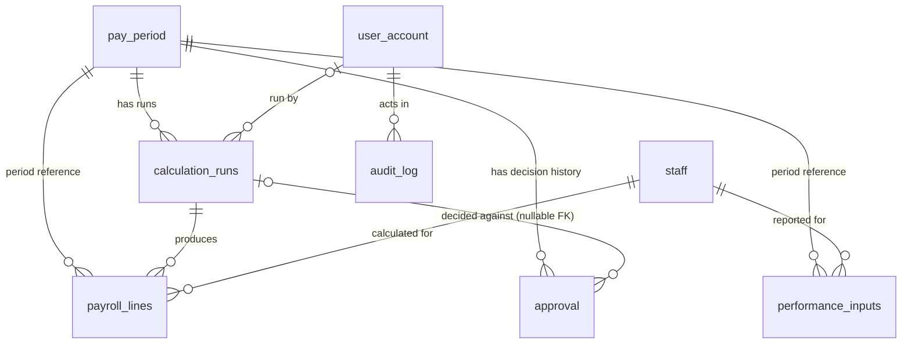

# UC-004 — Database Schema

## 1. Schema Overview

UC-004 does not calculate payroll or own most of the tables it touches — it is a status-transition and audit checkpoint sitting between UC-003 (calculation) and UC-005 (payment). Reading a period's summary follows `pay_period` → its latest `complete` `calculation_runs` row → that run's `payroll_lines`, joined to `staff` for names. Inspecting one line also reads that staff member's `performance_inputs` for the period. Recording a decision writes exactly one new `approval` row and one new `audit_log` row per submission, inside a single transaction, and updates the `pay_period` row's status/lock/totals in place.

`approval` is an **append-only history table**, not a single record per period — there is no unique constraint on `pay_period_id`, so a period can accumulate several rows over time (e.g. `rejected`, then later `approved` after recalculation). The real guard against double-approval is the `pay_period.status` check inside `submitDecision` (only `pending_approval` periods can be decided), not a database constraint on `approval`.

The tables below are grouped as: **owned/written by UC-004** (`approval`, and the UC-004 writes to `pay_period` and `audit_log`), **read directly by UC-004's SQL** (`calculation_runs`, `payroll_lines`, `staff`, `performance_inputs`), and **referenced only as foreign-key context** (`user_account`, `statutory_rate_sets` — detailed only where UC-004 actually depends on their shape).

## 2. Entity Relationship Overview

`audit_log.entity_id` is a polymorphic identifier (UC-004 always writes `entity_type = 'pay_period'`), not a database foreign key to each possible audited entity, so that link is not drawn above. `approval.calculation_run_id` is a nullable `NOT VALID` foreign key (added by a later migration), shown as optional.

## 3. Table Definitions

### `pay_period`

Shared payroll-period lifecycle record. UC-004 reads and — on decision — writes this table.

| Column | Type | Key / Constraint | Purpose |
| --- | --- | --- | --- |
| `id` | `UUID` | PK; default `uuid_generate_v4()` | Period identity |
| `start_date` | `DATE` | NOT NULL; UNIQUE | Period start |
| `end_date` | `DATE` | NOT NULL | Period end |
| `status` | `VARCHAR` | Default `draft`; CHECK `draft`, `validated`, `calculated`, `pending_approval`, `approved`, `paid` (`NOT VALID`) | UC-004 only acts when this is `pending_approval`; approve sets `approved`, reject sets `calculated` |
| `total_gross` | `NUMERIC(12,2)` | Nullable | Overwritten with the approved run's total on approval |
| `total_net` | `NUMERIC(12,2)` | Nullable | Overwritten with the approved run's total on approval |
| `is_locked` | `BOOLEAN` | NOT NULL; default `false` | Set `true` only on approval; UC-005 requires this |
| `locked_at` | `TIMESTAMP` | Nullable | Set to `now()` on approval, cleared (`NULL`) on rejection |
| `validated_at` | `TIMESTAMP` | Nullable | Set by an earlier (UC-002) workflow step; not written by UC-004 |
| `created_at`, `updated_at` | `TIMESTAMP` | Default `now()` | `updated_at` is refreshed on every decision |

### `calculation_runs`

Canonical, run-scoped calculation execution. UC-004 reads this table (never writes it) to find the authoritative run and to validate/lock it during a decision.

| Column | Type | Key / Constraint | Purpose |
| --- | --- | --- | --- |
| `id` | `UUID` | PK; default `uuid_generate_v4()` | Run identity |
| `period_id` | `UUID` | NOT NULL FK → `pay_period.id` | Period this run belongs to |
| `run_number` | `INTEGER` | NOT NULL; UNIQUE with `period_id` | Version within a period; UC-004 always uses the highest `run_number` with `status = 'complete'` |
| `rate_set_id` | `UUID` | NOT NULL FK → `statutory_rate_sets.id` | Rate-set provenance (not read by UC-004 beyond the FK existing) |
| `status` | `VARCHAR(20)` | NOT NULL; CHECK `running`, `complete`, `failed`, `voided` | UC-004 only considers `complete` runs authoritative |
| `total_gross` | `NUMERIC(12,2)` | Nullable | Copied onto `pay_period.total_gross` on approval |
| `total_employee_deductions` | `NUMERIC(12,2)` | Nullable | Not read by UC-004 |
| `total_employer_cost` | `NUMERIC(12,2)` | Nullable | Not read by UC-004 |
| `total_net_payable` | `NUMERIC(12,2)` | Nullable | Copied onto `pay_period.total_net` on approval |
| `lines_complete` | `INTEGER` | Nullable | Not read by UC-004's own logic |
| `lines_incomplete` | `INTEGER` | Nullable | UC-004 blocks approval (`INCOMPLETE_LINES`) unless this is `0` |
| `void_reason` | `TEXT` | Nullable | Not read by UC-004 |
| `run_by` | `UUID` | NOT NULL FK → `user_account.id` (`NOT VALID` replacement FK) | Who ran the calculation (UC-003 actor, not the UC-004 approver) |
| `run_at` | `TIMESTAMPTZ` | NOT NULL; default `now()` | Not read by UC-004's own logic |

### `payroll_lines`

Canonical per-employee calculation output. UC-004 reads this table only (never writes it).

| Column | Type | Key / Constraint | Purpose |
| --- | --- | --- | --- |
| `id` | `UUID` | PK; default `uuid_generate_v4()` | Line identity |
| `run_id` | `UUID` | NOT NULL FK → `calculation_runs.id`; UNIQUE with `staff_id`; indexed | Run provenance |
| `staff_id` | `UUID` | NOT NULL FK → `staff.id`; UNIQUE with `run_id` | Employee calculated |
| `period_id` | `UUID` | NOT NULL FK → `pay_period.id`; indexed | Period consistency/filter |
| `regular_hours`, `ot_hours`, `ph_hours` | `NUMERIC(10,2)` | Default `0` | Summed into `totalHours`/`otHours`/`phHours` in the line-detail response |
| `hourly_rate_used` | `NUMERIC(12,2)` | Nullable | Not read by UC-004 |
| `gross_from_hours` | `NUMERIC(12,2)` | Default `0` | Not read by UC-004 directly |
| `incentive_amount` | `NUMERIC(12,2)` | Default `0` | Returned as `incentivePay` |
| `adjustments_total` | `NUMERIC(12,2)` | Default `0` | Not read by UC-004 |
| `gross_total` | `NUMERIC(12,2)` | Default `0` | `gross_total − incentive_amount` is returned as `grossPay` |
| `cpf_employee` | `NUMERIC(12,2)` | Default `0` | Returned as `cpfAmount` |
| `cpf_employer` | `NUMERIC(12,2)` | Default `0` | Not read by UC-004 |
| `sdl` | `NUMERIC(12,2)` | Default `0` | Returned as `sdlAmount` |
| `net_pay` | `NUMERIC(12,2)` | Default `0` | Returned as `netPay` |
| `line_status` | `VARCHAR(20)` | NOT NULL; CHECK `complete`, `incomplete` | Returned as `status` on the line |
| `incomplete_reasons` | `JSONB` | Nullable | Not read by UC-004 |
| `calc_breakdown` | `JSONB` | Nullable | Not read by UC-004 |

### `approval`

UC-004's own history table — one row per approve/reject decision. This is the table UC-004 owns and writes.

| Column | Type | Key / Constraint | Purpose |
| --- | --- | --- | --- |
| `id` | `UUID` | PK; default `uuid_generate_v4()` | Decision identity |
| `pay_period_id` | `UUID` | NOT NULL FK → `pay_period.id` | Period decided |
| `calculation_run_id` | `UUID` | Nullable FK → `calculation_runs.id` (`NOT VALID`, added by migration `015`) | The run this decision was made against; always populated by `submitDecision` |
| `decision` | `VARCHAR` | NOT NULL; CHECK `approved`, `rejected` | The recorded outcome |
| `approved_by` | `VARCHAR(100)` | NOT NULL | Free-text snapshot of the manager's name/email/id at decision time — **not** a foreign key |
| `comment` | `TEXT` | Nullable | Required by application logic (not a DB constraint) when `decision = 'rejected'` |
| `decided_at` | `TIMESTAMP` | Default `now()` | Decision timestamp |
| `created_at` | `TIMESTAMP` | Default `now()` | Row-insert timestamp (Sequelize-managed; `updatedAt` disabled on this model) |

No unique constraint exists on `pay_period_id` — see the append-only note in Section 1.

### `audit_log`

Shared audit trail. UC-004 only ever inserts (`action` = `PAYROLL_APPROVED` or `PAYROLL_REJECTED`); it never reads this table.

| Column | Type | Key / Constraint | Purpose |
| --- | --- | --- | --- |
| `id` | `UUID` | PK; default `uuid_generate_v4()` | Log row identity |
| `entity_type` | `VARCHAR` | NOT NULL | Always `'pay_period'` for UC-004 rows |
| `entity_id` | `UUID` | Nullable (loosened by migration `005_uc005`) | The `pay_period.id` decided |
| `action` | `VARCHAR` | NOT NULL | `PAYROLL_APPROVED` or `PAYROLL_REJECTED` |
| `actor` | `VARCHAR` | NOT NULL | The manager's email, falling back to the `approved_by` snapshot |
| `detail` | `JSONB` | Nullable (legacy column from the original migration) | **Not** written by UC-004 — see `details` below |
| `user_id` | `UUID` | Nullable FK → `user_account.id` (added by migration `005_uc005`) | The authenticated manager's id |
| `user_role` | `VARCHAR(30)` | Nullable | The authenticated manager's role (`'manager'`) |
| `ip_address` | `VARCHAR(64)` | Nullable | Not written by UC-004 |
| `details` | `JSONB` | Nullable | UC-004 writes `{ calculationRunId, comment }` here |
| `created_at` | `TIMESTAMP` | Default `now()` | Log timestamp |

Note the two similarly-named JSONB columns: the original `detail` (singular) is unused by UC-004; the code writes to `details` (plural), added later alongside `user_id`/`user_role`/`ip_address`.

### `staff` (read-only dependency)

Read only for employee display name and employment type; UC-004 never writes this table.

| Column | Type | Key / Constraint | Purpose |
| --- | --- | --- | --- |
| `id` | `UUID` | PK; default `uuid_generate_v4()` | Staff identity |
| `full_name` | `VARCHAR` | NOT NULL | Returned as `fullName` on lines/line-detail |
| `employment_type` | `VARCHAR` | NOT NULL; CHECK `part_time`, `full_time` | Returned as `employmentType` on line-detail only |

Other `staff` columns (`external_ref`, `bank_account_no`, `bank_code`, `cpf_eligible`, `status`, timestamps) exist but are not read by UC-004's queries.

### `performance_inputs` (read-only dependency)

Read only to populate the line-detail modal's performance-input list; UC-004 never writes this table.

| Column | Type | Key / Constraint | Purpose |
| --- | --- | --- | --- |
| `id` | `UUID` | PK; default `uuid_generate_v4()` | Row identity |
| `staff_id` | `UUID` | NOT NULL FK → `staff.id` | Matched against the line's staff |
| `period_id` | `UUID` | NOT NULL FK → `pay_period.id` | Matched against the line's period |
| `input_type` | `VARCHAR(40)` | NOT NULL | Returned as `metricType` |
| `quantity` | `NUMERIC(10,2)` | NOT NULL; CHECK `>= 0` | Returned as `metricValue` |
| `unit_value` | `NUMERIC(12,2)` | NOT NULL | Returned as `unitValue` |
| `deleted_at` | `TIMESTAMPTZ` | Nullable (soft delete) | UC-004's query explicitly filters `WHERE deleted_at IS NULL` |

### `user_account` (FK / actor-identity dependency, not queried directly by UC-004's SQL)

Not queried directly inside `approvalService.js` — the authenticated manager's identity (`req.user`) is resolved earlier by the shared `authenticate` middleware via the `User` Sequelize model (`tableName: "user_account"`). Documented here because it is the FK target of `calculation_runs.run_by` and `audit_log.user_id`, and because its `role` column is what `authorize("manager")` checks.

| Column | Type | Key / Constraint | Purpose |
| --- | --- | --- | --- |
| `id` | `UUID` | PK; default `uuid_generate_v4()` | Actor identity |
| `full_name` | `VARCHAR(150)` | NOT NULL | Source of `approved_by` when present |
| `email` | `VARCHAR(255)` | UNIQUE, NOT NULL | Fallback source of `approved_by`; used as `audit_log.actor` |
| `role` | `VARCHAR(20)` | NOT NULL; CHECK `manager`, `employee` | Checked by `authorize("manager")` on every UC-004 route |
| `status` | `VARCHAR(20)` | NOT NULL; default `active`; CHECK `active`, `disabled` | A non-`active` account fails authentication (`INVALID_TOKEN`) before reaching UC-004 |

`statutory_rate_sets` is also an upstream FK target (via `calculation_runs.rate_set_id`) but is never read, directly or indirectly, by any UC-004 code path, so it is not detailed here.
